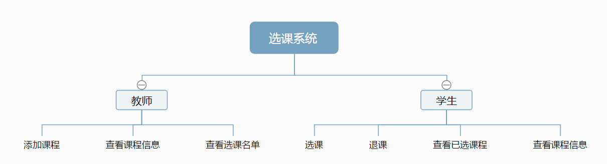
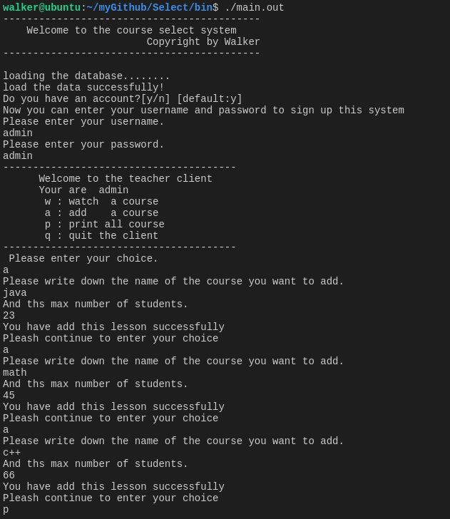
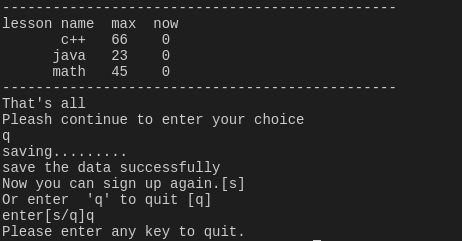
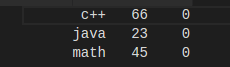
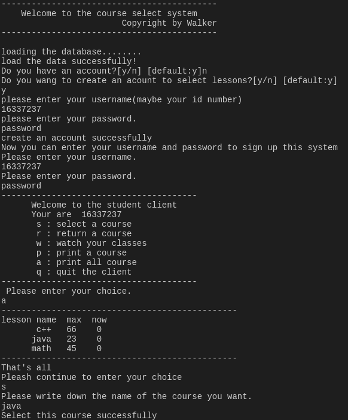
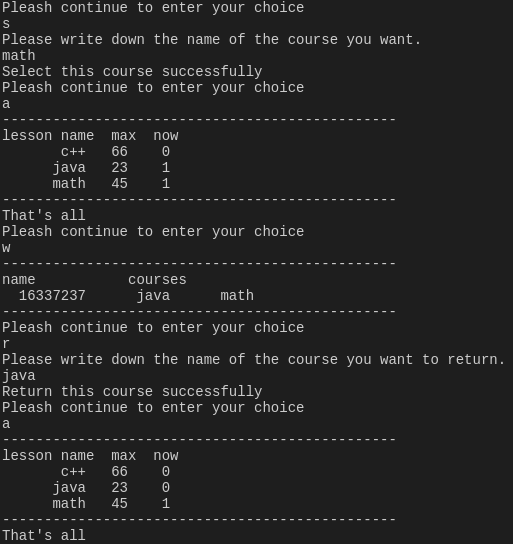
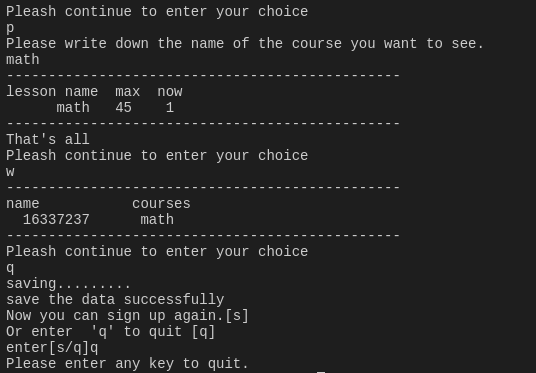

# <center>选课系统实验报告
#### <center> 计科教务4班 王永锋 16337237

### 1. 需求分析
对不同的用户主体，有着不同的需求

1. 教师
	2. 添加课程
	3. 查看所有课程信息
	4. 查看某课程及选该课程的同学的名单
2. 学生
	3. 选择课程
	4. 退出课程
	5. 查看所有课程信息（无法查看选课名单）
	6. 查看某课程信息（同样无法查看选课名单）
	7. 查看自己的选课列表

### 2. 实现思路




### 3. 数据设计
在程序开始运行时，会自动载入`./bin/data/`下的数据文件
并将数据放到map中以待使用

在程序结束时，会从map中取出数据存放回原目录下的数据文件

数据主要以维护三个map为主
```
map<string, Student> student_data;
map<string, Teacher> teacher_data;
map<string, Lesson> lesson_data;
```
而在Lesson类
使用一个vector存放选择该课的学生
```
vector<string> stud_selected;
```
在Student类中
使用一个vector存放选择选课列表

```
vector<string> selected_lesson;
```

### 4. 函数设计
#### Database类
该类主要提供对数据的操作的相关函数，是系统核心
1. 文件操作
```
    bool load(const string& studfile_name = "./data/student",
               const string& teachfile_name = "./data/teacher",
                const string& lessonfile_name = "./data/lesson");
    bool save(const string& studfile_name = "./data/student",
               const string& teachfile_name = "./data/teacher",
                const string& lessonfile_name = "./data/lesson");
```
2. 寻找类
```
    bool find_lesson(const string & lesson_name) const;
    int find_username(const string & user_name) const;
```

3. 添加项目类
```
    bool add_student(const string& stud_name, 
                       const string & stud_password);
    bool add_teacher(const string & teach_name,
                        const string & teach_password);
    bool add_lesson(const string & lesson_name,
                            const int max_num);
```

4. 修改类
```
    bool lesson_add_stud(const string& lesson_name,
                            const string & stud_name);
    bool lesson_delete_stud(const string& lesson_name,
                                const string & stud_name);
```

5. 打印信息类
```
    void print_student_public(const string & user_name) const;

    void print_student() const;
    void print_teacher() const;
    void print_lesson() const;
    void print_lesson(const string & lesson_name) const;
    void print_lesson_public(const string & lesson_name) const;
    void print_lesson_public() const;
```
#### Lesson类
1. 修改Lesson内数据的函数
```
    bool add_student(const string & stud_name);
    bool delete_student(const string & stud_name);
```
2. 得到lesson状态的函数
```
    inline const string get_name() const;
    inline bool is_empty() const;
    inline bool is_full() const;
```
3. 辅助输出函数
```
    inline void print() const;
    const string to_string() const;
    const string to_string_public() const;
```
#### Student 和 Teacher 类
这两个类继承自User类
#### User类

```
const string get_name() const {return m_name;};
bool verify(const string & try_password) const;
```

#### Student类

```
explicit Student(const string& data);
const string to_string() const;
const string to_string_public() const;
bool select_lesson(const string & lesson_name);
bool return_lesson(const string & lesson_name);
```

#### Teacher类
```
explicit Teacher(const string& data);
const string to_string() const ;
```

### 5. 输入输出

<<<<<<< HEAD
#### 1. bin/test.in
```

admin
admin
a
math
45
a
java
23
a
c++
66
q
q
```

（此时数据库中仅有一名老师账户，且没有课程数据，学生数据）



#### 2. bin/test2.in
```
n
y
16337237
password
16337237
password
a
s
java
a
s
math
a
w
r
java
a
p
math
w
q
q
```

（输入test.in后，课程数据内有三门课程）

(此后使用test2.in，注册一个学生并选课)





